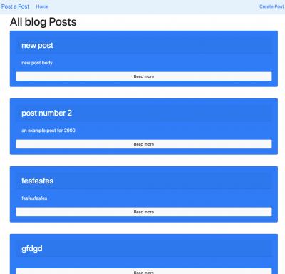

# rails-crash-course

a quick ruby on rails crash course

- Ruby version

- Rails

- Database =
  sqlite3

# web application overview

- MVC

- Post

- Comments

- form_for

- Bootstrap navbar, buttons, cards
